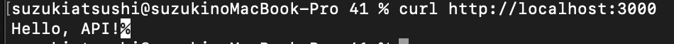

Nodeとは
> JavaScriptをブラウザ外で動かすための実行環境

Expressとは
> Node.js でHTTPサーバを作るための超シンプルなWebフレームワーク


実行するとき
```
node app.js
```

実行の確認
```
curl http://localhost:3000/
```

expressを呼び出し、インスタンス作成
```
const express = require('express');
const app = express();
```
ポート3000番を開く
```
const PORT = 3000;
```
GETリクエストをもらった時の実行内容を定義
```
app.get('/', (req, res) => {
  res.send('Hello, API!');
});
```
`req`:リクエスト情報
`res`:レスポンス操作用オブジェクト
res.sendで返答する文字列を定義している。

指定したポートでサーバを起動
```
app.listen(PORT, () => {
  console.log(`Server is running on http://localhost:${PORT}`);
});
```


result.png
