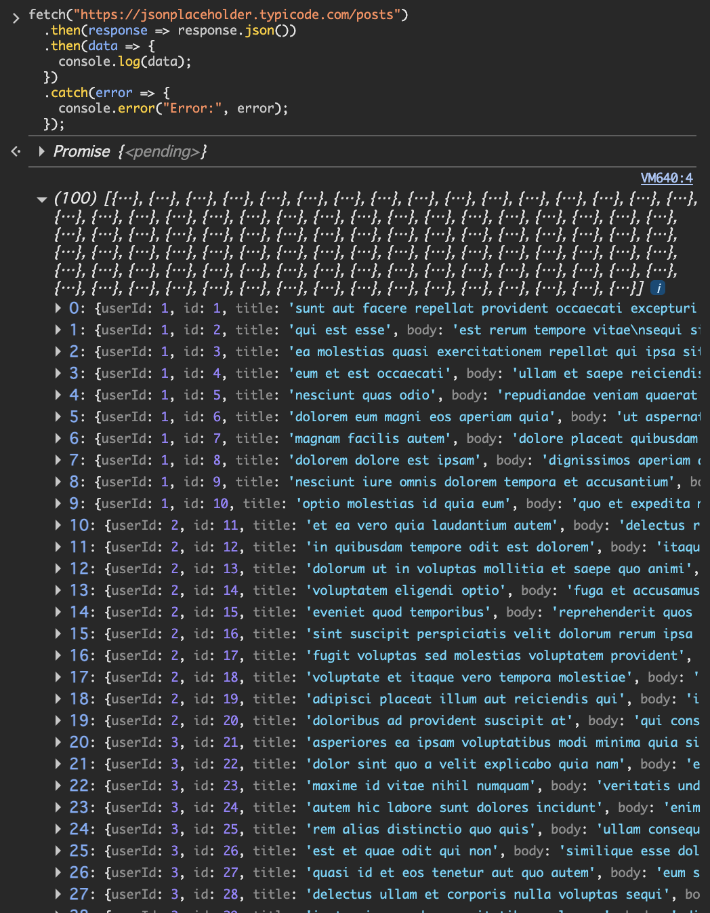

## 実行コード
```javascript
fetch("https://jsonplaceholder.typicode.com/posts")
  .then(response => response.json())
  .then(data => {
    console.log(data);
  })
  .catch(error => {
    console.error("Error:", error);
  });

```
### コードの説明

1. `fetch("https://jsonplaceholder.typicode.com/posts")`  
   指定したURLに対してHTTPのGETリクエストを送信する。  
   戻り値は取得結果そのものではなく，非同期処理を表す **Promise** である。

2. `.then(response => response.json())`  
   サーバから返ってきた `Response` オブジェクトを受け取り，本文をJSONとして読み込んで  JavaScriptの配列/オブジェクトに変換する（これも非同期でPromiseを返す）。

3. `.then(data => { console.log(data); })`  
   JSON変換後のデータ（投稿データの配列）を受け取り，`console.log` でコンソールに出力する。

4. `.catch(error => { console.error("Error:", error); })`  
   通信失敗やJSON変換失敗など，途中でエラーが発生した場合に実行され，エラー内容を表示する。

補足：fetchは非同期処理のため，リクエスト送信後すぐに結果が得られるわけではなく，完了後に `.then(...)` が順に実行される。


chromeで適当なページを開く  
開発者ツール=>console  
consoleにjsを記入・実行

## 結果
